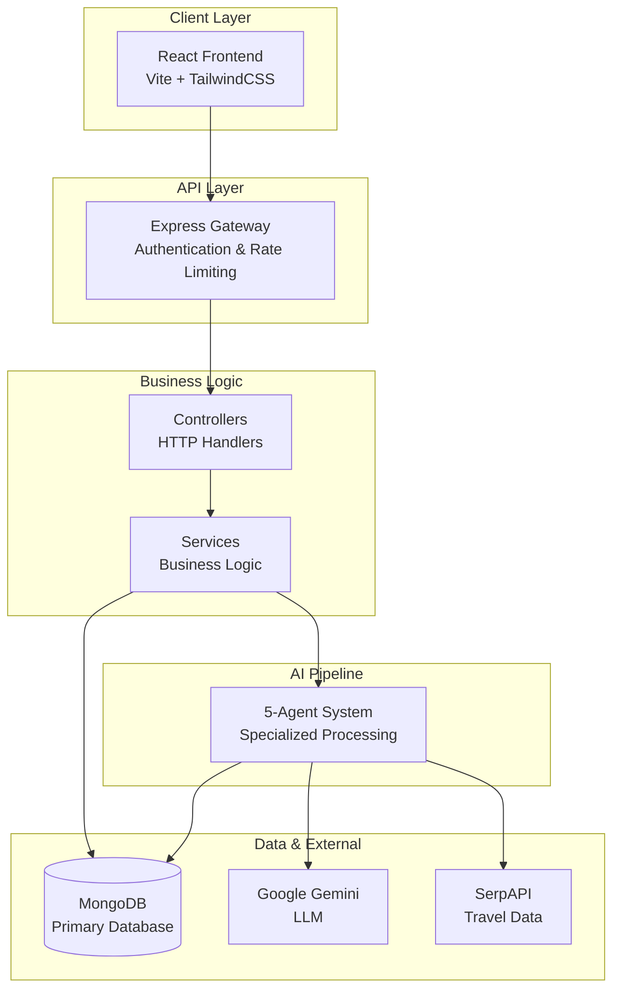
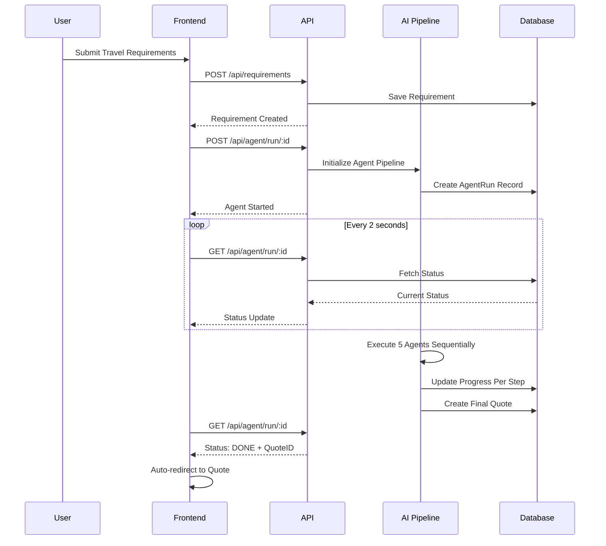
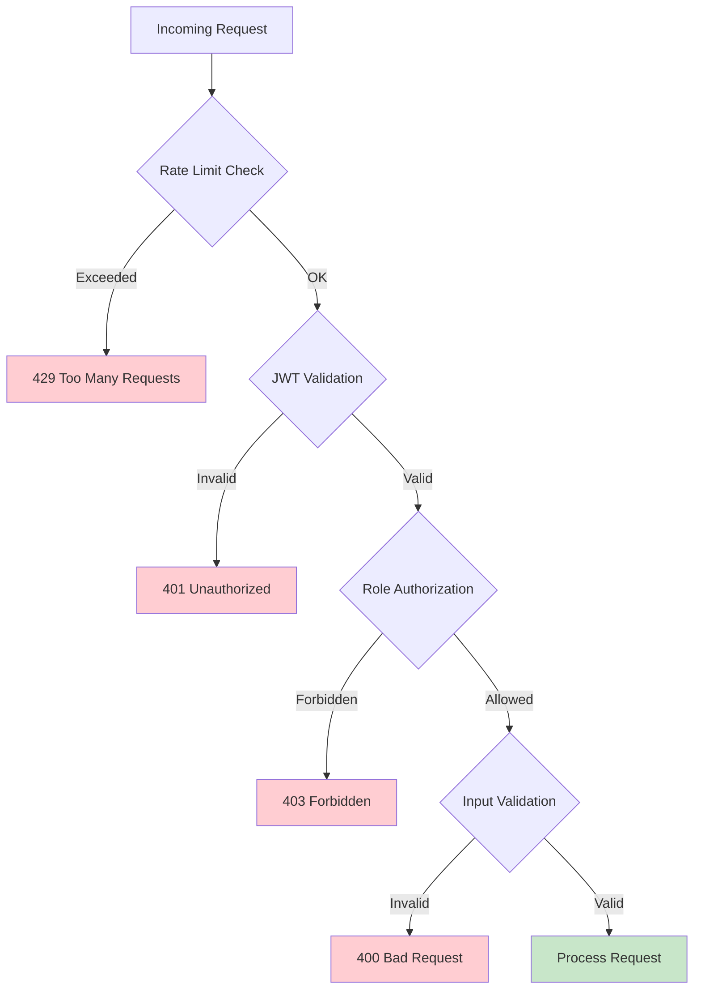
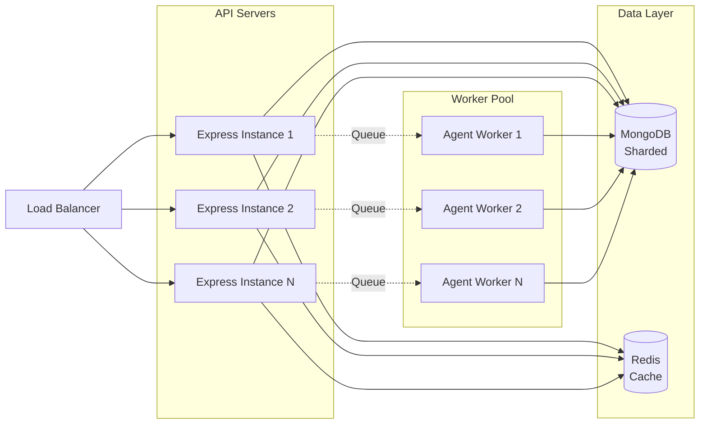

# 🌍 VoyageGen

> **AI-Powered Travel Quotation System for Modern B2B Agencies**

Transform hours of manual work into minutes with intelligent automation. VoyageGen leverages cutting-edge AI to generate professional travel quotations that your clients will love.

---

## 🎯 The Problem We Solve

Traditional travel quotation is **painful**:

- ⏰ **4-6 hours** per detailed itinerary
- 📊 Manual research across multiple platforms
- 💸 Pricing errors and missed margins
- 🔄 Endless revisions and reformatting
- 😓 Burnout from repetitive work

**VoyageGen eliminates these bottlenecks** with intelligent automation while keeping travel agents in control.

---

## ✨ Key Features

<table>
<tr>
<td width="50%">

### 🤖 AI-Powered Generation
Multi-agent system creates comprehensive itineraries with destination research, activity planning, and intelligent pricing

</td>
<td width="50%">

### ⚡ Lightning Fast
Generate professional quotations in **under 2 minutes** vs hours of manual work

</td>
</tr>
<tr>
<td width="50%">

### 🎨 Beautiful Output
Polished, client-ready quotations with day-by-day itineraries and transparent pricing breakdowns

</td>
<td width="50%">

### 🔐 Enterprise Security
JWT authentication, role-based access, and comprehensive input validation

</td>
</tr>
<tr>
<td width="50%">

### 📊 Quality Assurance
Automated validation ensures every quotation meets quality standards before delivery

</td>
<td width="50%">

### 🔄 Real-Time Processing
Live status updates with automatic redirection when quotations are ready

</td>
</tr>
</table>

---

## 🏗️ Architecture Overview

### System Design Philosophy

VoyageGen uses a **multi-agent architecture** where specialized AI agents work in sequence, each focusing on their domain expertise. This approach provides:

- ✅ **Reliability** - Step-by-step execution with error recovery
- ✅ **Transparency** - Detailed logging at each stage
- ✅ **Quality** - Independent validation throughout
- ✅ **Maintainability** - Update agents independently

### High-Level Architecture



---

## 🤖 The AI Agent Pipeline

Our **5-agent sequential pipeline** transforms raw requirements into professional quotations:

```mermaid
flowchart LR
    A[📝 User Input] --> B[🎯 SUPERVISOR]
    B --> |Normalized Data| C[🔍 RESEARCH]
    C --> |Destination Intel| D[📅 PLANNER]
    D --> |Structured Itinerary| E[💰 PRICE]
    E --> |Cost Breakdown| F[✅ QUALITY]
    F --> |Validated Quote| G[📄 Final Output]
    
    style A fill:#e3f2fd
    style B fill:#fff3e0
    style C fill:#f3e5f5
    style D fill:#e8f5e9
    style E fill:#fff9c4
    style F fill:#fce4ec
    style G fill:#e0f2f1
```



### Agent Responsibilities

| Agent | Role | Input | Output |
|-------|------|-------|--------|
| **🎯 SUPERVISOR** | Validate & normalize requirements | Raw user input | Structured, validated data |
| **🔍 RESEARCH** | Gather destination intelligence | Normalized requirements | Hotels, activities, attractions via SerpAPI |
| **📅 PLANNER** | Create detailed itinerary | Research data + requirements | Day-by-day structured plan |
| **💰 PRICE** | Calculate costs & margins | Itinerary + research data | Complete pricing breakdown |
| **✅ QUALITY** | Validate & score output | Complete quotation | Quality score & validation |

---

## 🛠️ Technology Stack

### Frontend

| Technology | Purpose |
|------------|---------|
| **React 19** | Modern UI framework with latest features |
| **Vite 7** | Lightning-fast build tool and dev server |
| **TailwindCSS 4** | Utility-first styling framework |
| **Framer Motion 12** | Smooth animations and transitions |

### Backend

| Technology | Purpose |
|------------|---------|
| **Express.js 5** | Web framework for Node.js |
| **MongoDB 6** | NoSQL database for flexible data storage |
| **Mongoose 9** | Elegant MongoDB object modeling |
| **JWT** | Secure token-based authentication |
| **Zod 4** | TypeScript-first schema validation |

### AI & External Services

| Service | Purpose |
|---------|---------|
| **Google Gemini 2.5 Flash** | Advanced language model for content generation |
| **SerpAPI** | Real-time travel data and destination info |

---

## 🚀 Request Flow



---

## 📁 Project Structure

### Backend Architecture

```
backend/src/
├── 🔧 config/           # Configuration (DB, CORS, Rate Limiting)
├── 🎮 controllers/      # HTTP request handlers
├── 🛡️ middleware/       # Auth, validation, error handling
├── 📦 models/           # Database schemas (User, Quote, AgentRun)
├── 🛣️ routes/           # API endpoint definitions
├── ⚙️ services/         # Business logic & AI agents
│   └── agents/         # Individual agent implementations
├── 🔨 utils/            # Helper functions
└── ✅ validators/       # Zod schemas for validation
```

### Frontend Architecture

```
frontend/src/
├── 🎨 components/       # Reusable UI components
├── 📄 pages/            # Route-level components
├── 🔐 context/          # React Context (Auth, etc.)
├── 🌐 api/              # API client functions
├── 🎯 hooks/            # Custom React hooks
└── 💅 styles/           # Global styles and themes
```

---

## 🔐 Security Features

### Multi-Layer Protection



### Security Layers

| Layer | Implementation | Protection |
|-------|----------------|------------|
| **Authentication** | JWT tokens (30-day expiry) | Verify user identity |
| **Authorization** | Role-based access control | Enforce permissions |
| **Rate Limiting** | Tiered limits per endpoint | Prevent abuse |
| **Input Validation** | Zod schemas | Prevent injection attacks |
| **Password Security** | bcrypt hashing (10 rounds) | Secure credential storage |

---

## 🎯 API Endpoints

### Authentication

```
POST   /api/auth/signup      # Register new user
POST   /api/auth/login       # Authenticate user
```

### Requirements Management

```
GET    /api/requirements     # List all requirements
POST   /api/requirements     # Create new requirement
GET    /api/requirements/:id # Get specific requirement
```

### Agent Operations

```
POST   /api/agent/run/:id    # Start AI pipeline
GET    /api/agent/run/:id    # Get run status
GET    /api/agent/runs       # List all agent runs
```

### Quotations

```
GET    /api/quotes           # List all quotes
GET    /api/quotes/:id       # Get specific quote
POST   /api/quotes           # Create manual quote
```

---

## 💻 Getting Started

### Prerequisites

- **Node.js** 18 or higher
- **MongoDB** 6.0+ (local or Atlas)
- **API Keys**: Google Gemini & SerpAPI

### Quick Start

#### 1️⃣ Clone & Install

```bash
# Clone repository
git clone <repository-url>
cd voyagegen

# Install backend dependencies
cd backend
npm install

# Install frontend dependencies
cd ../frontend
npm install
```

#### 2️⃣ Configure Environment

**Backend** (`backend/.env`):
```env
# Database
MONGO_URI=mongodb://localhost:27017/voyagegen

# Security
JWT_SECRET=your-super-secret-jwt-key-min-32-chars
PORT=5000

# AI Services
GEMINI_API_KEY=your-gemini-api-key
SERPAPI_KEY=your-serpapi-key

# CORS
FRONTEND_URL=http://localhost:5173
```

**Frontend** (`frontend/.env`):
```env
VITE_API_URL=http://localhost:5000
```

#### 3️⃣ Run Application

```bash
# Terminal 1 - Backend
cd backend
npm run dev
# Server running on http://localhost:5000

# Terminal 2 - Frontend
cd frontend
npm run dev
# App running on http://localhost:5173
```

#### 4️⃣ Access Application

Navigate to `http://localhost:5173` and start generating quotations! 🎉

---

## 🎨 Key Design Decisions

### Why Multi-Agent Architecture?

| Aspect | Benefit |
|--------|---------|
| **Specialization** | Each agent masters one domain (research, planning, pricing) |
| **Reliability** | Failures isolated to specific steps, easier debugging |
| **Quality Control** | Independent validation at each stage |
| **Maintainability** | Update individual agents without affecting others |
| **Transparency** | Clear audit trail of processing steps |

### Why Separate Pricing Logic?

- 💼 **Business Flexibility** - Adjust margins without changing itineraries
- 🧪 **A/B Testing** - Test different pricing strategies
- 📊 **Compliance** - Separate pricing rules for regulatory requirements
- 🔄 **Reusability** - Same itinerary, different pricing models

### Why Quality Validation Agent?

- ✅ **Minimum Standards** - Ensure every quotation meets quality thresholds
- 🎯 **Consistency** - Automated checking for completeness and accuracy
- 🛡️ **Risk Mitigation** - Catch AI hallucinations before client delivery
- 📈 **Continuous Improvement** - Quality metrics drive system enhancements

---

## 📊 Performance Optimization

### Database Optimization

- **Strategic Indexing** - Optimized for common query patterns
- **Selective Field Loading** - Fetch only required data
- **Connection Pooling** - Efficient database connections

### API Performance

- **Request Validation** - Fail fast on invalid inputs
- **Rate Limiting** - Prevent resource exhaustion
- **Efficient Polling** - Smart interval management (2s)

### Frontend Optimization

- **Code Splitting** - Lazy load heavy components
- **Conditional Loading** - Load libraries only when needed
- **Optimized Rendering** - React best practices throughout

---

## 🚀 Scaling Strategy

### Horizontal Scaling Ready



### Future Enhancements

- **Caching Layer** - Redis for session & frequent queries
- **Message Queue** - RabbitMQ/Bull for async agent processing
- **Microservices** - Separate AI, notifications, analytics services
- **CDN Integration** - Static asset delivery optimization

---

## 🧪 Future Roadmap

### Testing Infrastructure
- Unit testing with Jest
- Integration tests with Supertest
- E2E testing with Playwright
- Mocked AI responses for consistent testing

### Monitoring & Observability
- Application performance monitoring
- Error tracking with Sentry
- Business metrics dashboard
- User analytics integration

### Advanced Features
- 🌐 Multi-language support
- 📱 React Native mobile app
- 🤖 ML-powered personalization
- 📧 Automated email quotations
- 📊 Advanced analytics dashboard

---

## 🏆 Why VoyageGen?

<table>
<tr>
<td width="33%" align="center">
<h3>⚡ 95% Time Savings</h3>
From 4-6 hours to under 2 minutes per quotation
</td>
<td width="33%" align="center">
<h3>🎯 100% Quality</h3>
Every quotation validated by AI quality agent
</td>
<td width="33%" align="center">
<h3>🔐 Enterprise Ready</h3>
Security, scalability, and reliability built-in
</td>
</tr>
</table>

---

## 📝 License

This project is proprietary software. All rights reserved.

---

## 🤝 Contributing

We welcome contributions! Please see our contributing guidelines for more information.

---

## 📧 Support

For questions, issues, or feature requests, please contact our support team or open an issue in the repository.

---

<div align="center">

**Built with ❤️ for the modern travel industry**

**VoyageGen** - Where AI meets Travel Excellence

[Documentation](#) • [API Reference](#) • [Demo](#) • [Support](#)

</div>